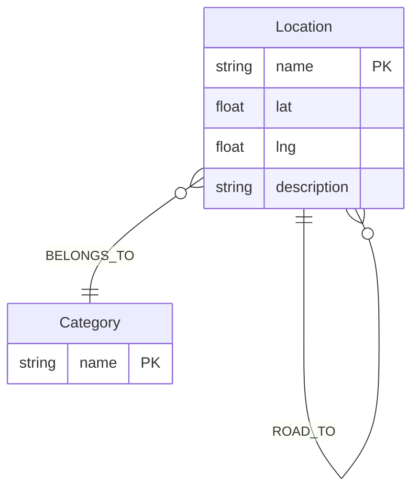
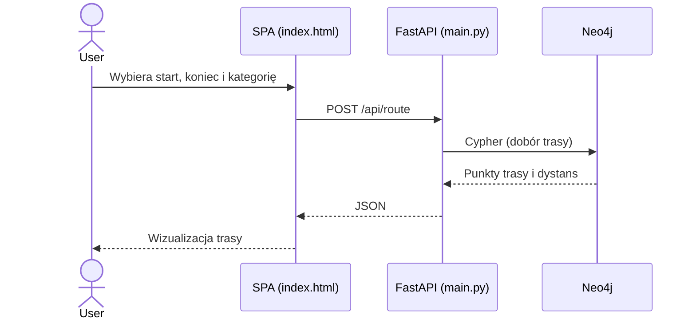

# Generator Roadtripów Tematycznych

Projekt akademicki prezentuje praktyczne zastosowanie grafowej bazy danych Neo4j do planowania tras drogowych z wymuszonym punktem pośrednim należącym do wskazanej kategorii tematycznej. Rozwiązanie obejmuje kompletny serwis typu SPA + REST:
- frontend SPA w `index.html` (Leaflet + Tailwind),
- backend REST w FastAPI (`main.py`),
- natywną grafową bazę danych Neo4j,
- skrypt seedujący dane grafowe (`seed.py`).

## 1. Zgodność z wymaganiami projektowymi

Poniżej mapowanie wymagań zaliczeniowych na elementy projektu:

1. Poprawnie działająca aplikacja lub serwis
- Zrealizowano serwis REST (`GET /api/locations`, `GET /api/categories`, `POST /api/route`) oraz aplikację SPA wizualizującą trasę na mapie.
- Logika biznesowa wykorzystuje model grafowy i zapytania ścieżkowe Cypher.

2. Udokumentowany kod źródłowy aplikacji
- Kod backendu i seedera jest opisany strukturą modułową oraz czytelnym podziałem odpowiedzialności.
- Dokumentacja uruchomienia i architektury znajduje się w niniejszym README.

3. Prezentacja struktury grafu i poleceń realizujących funkcjonalność
- W sekcji 4 opisano model grafu (węzły, relacje, właściwości).
- W sekcji 5 przedstawiono kluczowe zapytania Cypher wykorzystywane przez aplikację.

4. Dokumentacja z diagramami UML i opisem wdrożenia
- W sekcji 6 znajdują się diagramy UML zapisane w składni Mermaid (model pojęciowy i przepływ komponentów).
- W sekcji 2 zawarto profesjonalny opis wdrożenia środowiska i uruchomienia projektu.

## 2. Wdrożenie i uruchomienie (Docker Compose + WSL)

Rekomendowana i wspierana ścieżka uruchomienia to Docker w WSL (Ubuntu).

### 2.1 Wymagania środowiskowe
- WSL2 z dystrybucją Ubuntu,
- Docker Engine i Docker Compose Plugin w WSL,
- dostęp do katalogu projektu pod `/mnt/c/...`.

Instalacja Dockera w WSL (jednorazowo):

```bash
sudo apt update
sudo apt install -y docker.io docker-compose-plugin
sudo usermod -aG docker $USER
newgrp docker
```

### 2.2 Start usług

```bash
cd /mnt/c/Users/Mariu/OneDrive/Dokumenty/Bazy2/TripPlanner
docker compose up -d --build
```

Po starcie:
- frontend SPA: `http://127.0.0.1:5500/index.html`,
- backend API (host): `http://127.0.0.1:8001`,
- Neo4j Browser: `http://127.0.0.1:7474`.

### 2.3 Seed danych grafowych

```bash
docker compose --profile tools run --rm seed
```

### 2.4 Zatrzymanie środowiska

```bash
docker compose down
```

## 3. Opis funkcjonalny aplikacji

Użytkownik wybiera:
- punkt startowy,
- punkt docelowy,
- kategorię pośrednią.

System:
- pobiera dane lokalizacji i kategorii z Neo4j,
- wyznacza trasę spełniającą warunek przejazdu przez lokalizację z wybranej kategorii,
- zwraca trasę i dystans,
- wizualizuje wynik na mapie (Leaflet).

Wizualizacja na frontendzie korzysta z geometrii drogowej (routing po drogach) dla segmentów trasy, co poprawia realizm przebiegu względem prostej polilinii między punktami.

## 4. Struktura grafu i uzasadnienie wyboru Neo4j

### 4.1 Model danych
- Węzły:
  - `:Location(name, lat, lng, description)`
  - `:Category(name)`
- Relacje:
  - `(:Location)-[:BELONGS_TO]->(:Category)`
  - `(:Location)-[:ROAD_TO {distance_km, duration_min}]->(:Location)`

### 4.2 Uzasadnienie technologiczne

Problem planowania tras jest relacyjny i ścieżkowy. Neo4j umożliwia:
- naturalne modelowanie połączeń drogowych jako grafu,
- efektywne traversale i wyszukiwanie ścieżek,
- łatwe dodawanie kolejnych warstw semantycznych (preferencje, ograniczenia, sezonowość).

## 5. Kluczowe zapytania Cypher

### 5.1 Czyszczenie bazy
```cypher
MATCH (n) DETACH DELETE n
```

### 5.2 Tworzenie kategorii
```cypher
CREATE (:Category {name: $name})
```

### 5.3 Tworzenie lokalizacji
```cypher
CREATE (:Location {name: $name, lat: $lat, lng: $lng, description: $description})
```

### 5.4 Relacja lokalizacja-kategoria
```cypher
MATCH (location:Location {name: $location_name})
MATCH (category:Category {name: $category_name})
CREATE (location)-[:BELONGS_TO]->(category)
```

### 5.5 Relacje drogowe dwukierunkowe
```cypher
MATCH (start:Location {name: $start_name})
MATCH (end:Location {name: $end_name})
CREATE (start)-[:ROAD_TO {distance_km: $distance_km, duration_min: $duration_min}]->(end)
CREATE (end)-[:ROAD_TO {distance_km: $distance_km, duration_min: $duration_min}]->(start)
```

### 5.6 Wyznaczanie trasy przez kategorię pośrednią
```cypher
MATCH (start:Location {name: $start})
MATCH (destination:Location {name: $end})
MATCH (category:Category {name: $category})
MATCH (waypoint:Location)-[:BELONGS_TO]->(category)

CALL {
  WITH start, waypoint
  MATCH path_to_waypoint = (start)-[:ROAD_TO*1..12]->(waypoint)
  WITH path_to_waypoint,
       reduce(distance = 0.0, road IN relationships(path_to_waypoint) | distance + road.distance_km) AS segment_distance_1
  ORDER BY segment_distance_1 ASC
  LIMIT 1
  RETURN path_to_waypoint, segment_distance_1
}

CALL {
  WITH waypoint, destination
  MATCH path_to_destination = (waypoint)-[:ROAD_TO*1..12]->(destination)
  WITH path_to_destination,
       reduce(distance = 0.0, road IN relationships(path_to_destination) | distance + road.distance_km) AS segment_distance_2
  ORDER BY segment_distance_2 ASC
  LIMIT 1
  RETURN path_to_destination, segment_distance_2
}
```

## 6. Diagramy UML (Mermaid)

### 6.1 Diagram pojęciowy (ER)


### 6.2 Diagram komponentów/przepływu (SPA -> REST -> Neo4j)


## 7. Struktura kodu źródłowego

- `main.py` - backend REST FastAPI i logika zapytań do Neo4j,
- `seed.py` - inicjalizacja i zasilenie grafu danymi testowymi,
- `index.html` - frontend SPA, formularz i mapa Leaflet,
- `requirements.txt` - zależności Python,
- `docker-compose.yml` - orkiestracja usług,
- `Dockerfile` - obraz backendu,
- `README.md` - kompletna dokumentacja projektu.

## 8. Podsumowanie

Projekt spełnia wymagania kursowe dla grafowych baz danych:
- wykorzystuje natywną bazę grafową Neo4j,
- realizuje funkcjonalny serwis prezentujący praktyczny przypadek użycia,
- zawiera udokumentowane zapytania i model grafu,
- posiada opis wdrożenia oraz diagramy UML.
